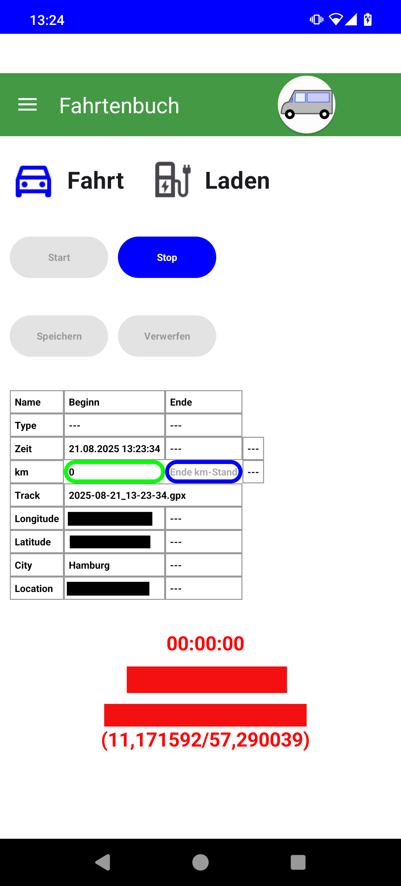
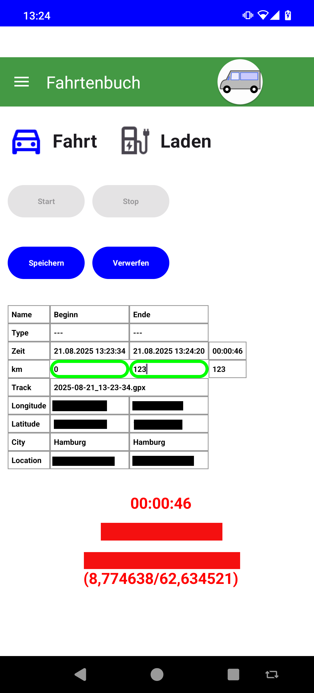
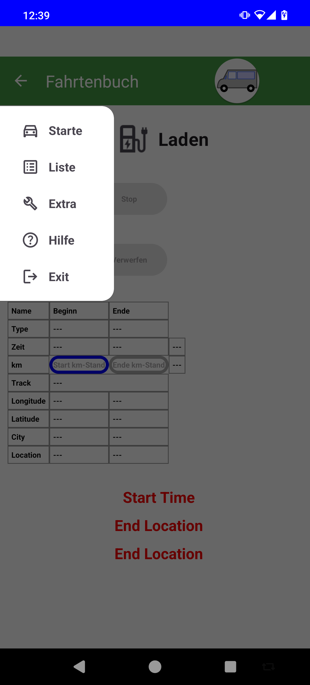
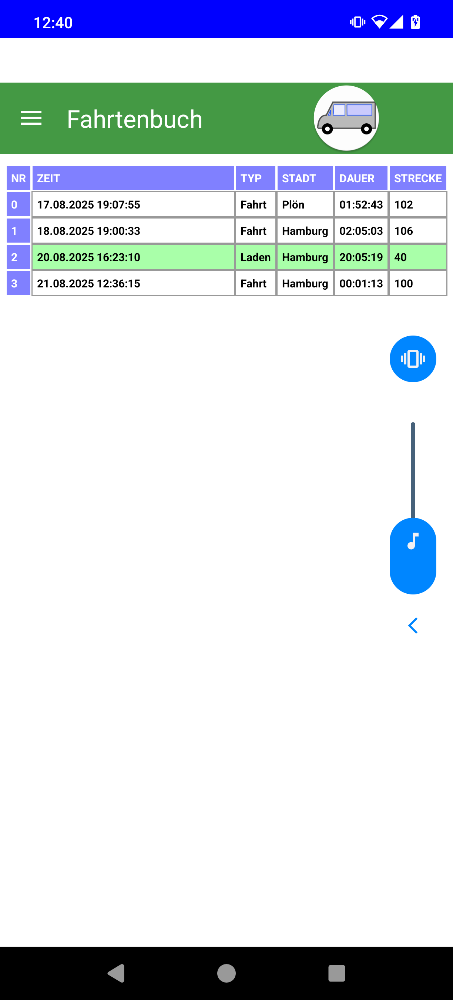
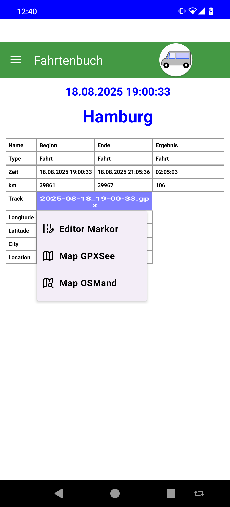
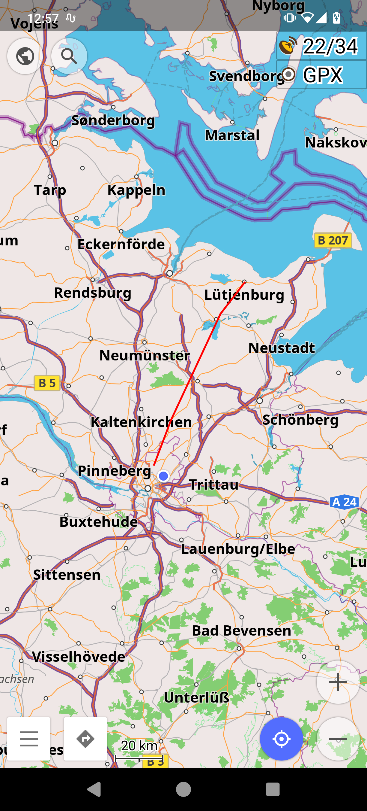

# Fahrtenbuch (Driver's book)

I want a simple possibility to note my way with my car. I started to notice my driving
in a small booklet, but I thought of an app. So this is my first android app, a small
driver's book.

My simple thinking was: press a start button, everything is noticed automatically.
Press a stop button, everything is noticed automatically. For now it is not easy like
that, I only have to notice the start kilometer and the end kilometer before each
pressing of the button.

My aims for the future are, access the cars data automatically and access the electricity
meter automatically.

Here are some screenshots of the app:

<table>
<tr><td> Start screen with 'Start' and 'Stop' Button for your trip. Press 'Start' for recording.
</td><td> Press 'Stop' to stop Recording.
</td><td> Details of a trip.
</td></tr>

<tr><td>
</td><td>
</td><td>
</td></tr>

<tr><td> List of all trips and chargings.
</td><td> Details of a trip or charging.
</td><td> Map of your trip, GPS Data moved to OSMAnd.
</td></tr>

<tr><td>
</td><td>
</td><td>
</td></tr>
</table>

## Start screen

The 'Start' Screen let you start to record your trip. Means the starting and end point with data is stored, The GPS data
is recorded every minute. When you press 'Stop' the recording stops. Before 'Start' and 'Stop' you must type the km-State
of your car.

Afterwards you must save 'Speichern' your data. You can also cancel 'Verwerfen' your data.

## List screen

In the List you see all your recorded tracks. You can change to the detail view of each entry.

## Detail screen

On the Detail screen you can see the recorded details of your trip and change to a map view.
You can open the GPX file also in Markor-Editor App.

## Map App

On the Map you can see your recorded GPS data in OSMand or GPXSee.
------
