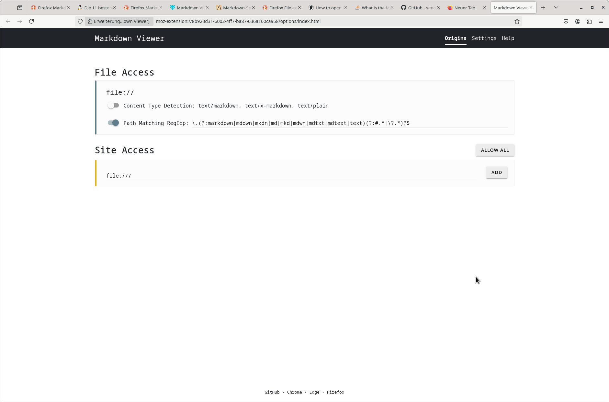

<!DOCTYPE text/markdown>

# Markdown

## Inhalt

1. [Kurzreferenz](#kurzreferenz)
2. [Installation Firefox Plugin 'Markdown Viewer'](#installation-firefox-plugin-markdown-viewer)
3. [Installation 'Markdown Editor'](#installation-markdown-editor)
4. [Testlink](#testlink)

## Kurzreferenz

Kurzreferenz:

    # Überschrift
    ## Überschrift
    - Aufzählung
    1. Aufzählung
    *Kursiv* _Kursiv_
    **Fett** __Fett__

    für Inhaltsverzeichnis: (Im link alles klein geschrieben, Sonderzeichen durch "-" ersetzt.
        1. [Link](#link)
        2. [Zweiter Link](#zweiter-link)
        ## Link
        ## Zweiter Link

## Installation Firefox Plugin 'Markdown Viewer'

19.08.2025 - Installation "Markdown Viewer" als Firefox Erweiterung.

    Aus Internetsuche um in Firefox Markdown files zu öffnen (hat aber auch schon vorher funktioniert.
    Leider öffnet kein "Markdown Viewer" Plugin.

    Firefox: "about:config"
    Firefox: "helpers.private_mime_types_file"   "~/.mime.types
    # vi .mime.types
    "text/plain     md txt"
    "text/markdown" md               Habe ich hinzugefügt?

https://github.com/simov/markdown-viewer#table-of-contents

## Installation 'Markdown Editor'

19.08.2025 - Installation "Markdown Editor" Plugin.

## Testlink

Dieses Kapitel dient nur dazu den Inhaltsverzeichnis Link zu testen. Leider haben bei mir die internen Links
innerhalb des Dokumentes nicht funktioniert. 

